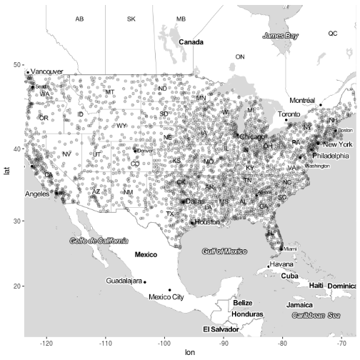

The start of my Git Pages site began with doing some daily challenges to work on my coding skills. However, with taking up some more physical challenges (i.e., working out 2 or 3 times a day, training for a marathon, power lifting, etc.), that fell by the wayside. Now I'm reinventing this site using a new (and awesome!) theme I really like. However, I did not want to lose all of the content from that initial launch at the start of the year. Below, I migrated the R markdown files to their markdown results as best I could. If there is anything wrong, go ahead and let me know either in a comment or a bug fix on the site repo. Otherwise, enjoy!

-------------------------------------------------------------------------------
# Day 1

This day I'm going to venture into an area I'm not so familiar with: generative models. Most of what I have been taught in machine learning has focused on typical discriminative models for learning. To me, I think generative models have so much more potential for really tapping into probability distributions and simulation capabilities of your data. I say this as I'm totally novice about it! Nevertheless, implementing naive bayes is not hard to do. What I wanted to see was how to show those conditional probabilities in the margin of the data. 

Today we use the iris data set that ships with R. 

For inspiration on how to set up the marginal plots, see http://www.statmethods.net/advgraphs/layout.html

~~~ r
library(e1071)  # naiveBayes
library(RColorBrewer) # brewer.pal

# foo
table_dnorm <- function(row, from, to, n = 101 ,...) 
{
    xseq <- seq(from, to, length.out = n)
    dnorm(xseq, row[1], row[2], ...)
}

# Plots the PDF from a Naive Bayes conditional probability table
plot_density <- function(x, from, to, flip = FALSE, ...) {
    require(RColorBrewer)
    pal <- brewer.pal(3, 'Dark2')
    names(pal) <- sort(rownames(x))    

    m <- apply(x, 1, table_dnorm, from = from, to = to)
    if (flip)
    {
        matplot(m, seq(nrow(m)), type = 'l', lty = 1, col = pal,
                xaxt = 'n', yaxt = 'n', xlab = '', ylab = '')
    } else
    {
        matplot(m, type = 'l', lty = 1, col = pal,
                xaxt = 'n', yaxt = 'n', xlab = '', ylab = '')
    }
    invisible(m)
}

# Example Data
data(iris)

# Fit the Naive Bayes Model
fit <- naiveBayes(Species ~ ., data = iris)

# For convenience
SL <- fit$tables$Sepal.Length
PL <- fit$tables$Petal.Length
SW <- fit$tables$Sepal.Width
PW <- fit$tables$Petal.Width

# See the marginals among sepal and petal lengths
par(fig = c(0.0, 0.8, 0.0, 0.8), mar = c(5, 4, 0, 0))
pal <- brewer.pal(3, 'Dark2')
names(pal) <- levels(iris$Species)
plot(Sepal.Length ~ Petal.Length, iris, col = pal[Species], 
     pch = 20, las=1, xlim = c(1, 7), ylim = c(4, 8))

par(fig = c(0.0, 0.8, 0.8, 1.0), mar = c(1, 4, 1, 0), new = TRUE)
plot_density(PL, 1, 7)

par(fig = c(0.8, 1.0, 0.0, 0.8), mar = c(5, 1, 0, 1), new = TRUE)
plot_density(SL, 4, 8, flip = TRUE)
~~~

~~~ r
# See the marginals among sepal and petal widths
par(fig = c(0.0, 0.8, 0.0, 0.8), mar = c(5, 4, 0, 0))
plot(Sepal.Width ~ Petal.Width, iris, col = pal[Species], 
     pch = 20, las=1, xlim = c(0, 3), ylim = c(2, 5))

par(fig = c(0.0, 0.8, 0.8, 1.0), mar = c(1, 4, 1, 0), new = TRUE)
plot_density(PW, 0, 3)

par(fig = c(0.8, 1.0, 0.0, 0.8), mar = c(5, 1, 0, 1), new = TRUE)
plot_density(SW, 2, 5, flip = TRUE)
~~~

-------------------------------------------------------------------------------
# Day 2

Here I want to explore working with a "nearest neighbor" model as represented in a KD-tree. This is a data structure I've worked on in my Data Structures class, and it is really neat (I'd like to port it into R some day). What the RANN library does is provide a way to get its functionality (efficient range searches) in a nearest neighbor model.

Since I currently work as a data scientist at an electricity utilty, I found some public data for a similar use case: find the nearest load shapes to a provided load shape (either between customers or within a customer across the year). 

* [Data Source](http://en.openei.org/datasets/files/961/pub/)
* [Data File](http://en.openei.org/datasets/files/961/pub/RESIDENTIAL_LOAD_DATA_E_PLUS_OUTPUT/BASE/USA_CA_Sacramento.Exec.AP.724830_TMY3_BASE.csv)

~~~ r
library(RANN)  # nn
library(reshape2)  # dcast

# Custom Parser for Date.Time column
parser <- function(fmt)
{
    function(x)
    {
        # Define Return Object
        data.frame(
            # x[1] is an empty split from leading whitespace
            day  = as.Date(x[2], fmt), 
            hour = as.numeric(substr(x[3], 1, 2))
        )
    }
}

# Import Today's Data
infile <- url("http://en.openei.org/datasets/files/961/pub/RESIDENTIAL_LOAD_DATA_E_PLUS_OUTPUT/BASE/USA_CA_Sacramento.Exec.AP.724830_TMY3_BASE.csv")
x <- read.csv(infile, as.is = TRUE)[1:2]  # Only using Electricity
names(x) <- c("datetime", "kwh")
dt <- do.call(rbind, lapply(strsplit(x$datetime, ' +'), parser('%m/%d')))

x <- data.frame(x, dt)  # Hourly Grain
y <- reshape2::dcast(x, day ~ hour, value.var = 'kwh')  # Daily Grain

# kd-tree search model
kd <- nn2(y[-1], k=6)  # k=5 with 1 for matching self

# Every Day vs Top 5 (blue) vs This Day (red)
# What happened with Sep 28?? That's really the nearest 5?
set.seed(600)
for (i in 1:5)  # Try 5 Random Days; Review Plots Afterwards
{
    p <- sample(1:365, 1)  # Choose a random day
    idx <- kd$nn.idx[p, -1]  # top5 similar days to p
    
    matplot(t(y[-1]), type = 'l', col = 'gray80', lty = 2, main = y$day[p],
            las = 1, xlab = "Hour of Day (24 hours)", ylab = "kWh")
    matlines(t(y[idx, -1]), col = 'steelblue', lty = 1)
    lines(t(y[p, -1]), col = 'indianred', lwd=2)
}
~~~

-------------------------------------------------------------------------------
# Day 3

## Definition

    Dollar-cost averaging (DCA) is an investment technique of buying a fixed dollar
    amount of a particular investment on a regular schedule, regardless of the
    share price. The investor purchases more shares when prices are low and fewer
    shares when prices are high. The premise is that DCA lowers the average share
    cost over time, increasing the opportunity to profit. The DCA technique does
    not guarantee that an investor won't lose money on investments. Rather, it is
    meant to allow investment over time instead of investment as a lump sum.
[source](http://www.investopedia.com/terms/d/dollarcostaveraging.asp)

### Objective

The set up is each month we spend $1,000 to purchase as many shares as possible. We will round up to purchase full shares (no partial purchase situation). The stock symbol will be iShares Large Cap Value ETF ([IVE](http://finance.yahoo.com/quote/IVE)). This is an index ETF I will purchase more of this year, so I want to compare the two situations: using DCA vs. lump-sum purchase at the start of 2016.

For those that don't know, the `'2016::'` subset gets everything 2016 and beyond. The `to.monthly` (*xts*) function grabs the first value of each month. The `Op` (*quantmod*) function extracts the Opening column of the stock symbol object. This sets us up to work with the open value the first of each month when we hypothetically make a purchase. 

~~~ r
library(quantmod)
getSymbols("IVE")
~~~

~~~
## [1] "IVE"
~~~

~~~ r
# Percent change between start to end
q <- function(start, end) (end-start) / start

x <- Op(to.monthly(IVE['2016::']))
x <- as.vector(x)
n <- length(x)
final_price <- x[n]
x <- x[-n]

purchased <- ceiling(1000 / x)  # monthly shares purchased
invested <- purchased * x  # monthly expense
sum(invested - 1000)  # Total amount extra spent above $1,000 each month
~~~

~~~
## [1] 621.6201
~~~

~~~ r
sum(invested)  # Total invested (without changes)
~~~

~~~
## [1] 16621.62
~~~

~~~ r
sum(purchased)  # Total shares after period
~~~

~~~
## [1] 176
~~~

~~~ r
result <- c(
    'dca_result' = sum(q(x, final_price) * invested),
    'lump_result' = sum(invested) * q(x[1], final_price),
    'avg_result' = mean(q(x, final_price)) * sum(invested))

result / sum(invested) * 100  # proportion gained 
~~~

~~~
##  dca_result lump_result  avg_result 
##    10.24870    19.32157    10.31291
~~~

So I'll just assume I didn't screw this up. We see that the DCA result was no where near as good as just purchasing everything lump sum at the beginning of the year. It's also nearly the same result as just taking the mean % change over the period as shown in the avg_result. 

Now let's see about over the last decade

~~~ r
x <- Op(to.monthly(IVE))
x <- as.vector(x)
n <- length(x)
final_price <- x[n]
x <- x[-n]

purchased <- ceiling(1000 / x)  # monthly shares purchased
invested <- purchased * x  # monthly expense
sum(invested - 1000)  # Total amount extra spent above $1,000 each month
~~~

~~~
## [1] 4221.88
~~~

~~~ r
sum(invested)  # Total invested (without changes)
~~~

~~~
## [1] 128221.9
~~~

~~~ r
sum(purchased)  # Total shares after period
~~~

~~~
## [1] 1880
~~~

~~~ r
result <- c(
    'dca_result' = sum(q(x, final_price) * invested),
    'lump_result' = sum(invested) * q(x[1], final_price),
    'avg_result' = mean(q(x, final_price)) * sum(invested))

result / sum(invested) * 100 / 10  # proportion gained per year
~~~

~~~
##  dca_result lump_result  avg_result 
##    5.266162    3.452196    5.289703
~~~

In this case, clearly the recession ruined the potential gains one would have made from a lump sum purchase in 2007. While gains using dollar-cost averaging are historically low, it is still better than trying to time the market. This may just be two scenarios, but one thing it highlights is that unless you think you can time the market, you can hit or miss with lump sum investments. At least with a DCA approach, you spread that risk out and you can always make an extra purchase when you think you are timing correctly. 

-------------------------------------------------------------------------------
# Day 4

So I tried toying around with some Bayesian stuff, motivated by Variance Explained

http://varianceexplained.org/r/empirical_bayes_baseball/

While I was able to recreate what the author did, there isn't any real value in showing that here. I tried to work with some other data sets (e.g., the Titanic dataset), but there wasn't anything worth saving. 

One thing I did was take the code the author had and wrapped it in a closure so its easier to submit your vectors of successes and totals into the log likelihood function to be mle'd (see his code example). 

### His Example

Here he hardcodes the career variables directly into the ll function.

~~~ r
library(VGAM)

# negative log likelihood of data given alpha; beta
ll <- function(alpha, beta) 
{
  -sum(dbetabinom.ab(career$H, career$AB, alpha, beta, log = TRUE))
}

m <- mle(ll, start = list(alpha = 1, beta = 10), method = "L-BFGS-B")
coef(m)
~~~

### My Tweak

Instead of hardcoding the variable values into the function. I make it available to any data values coming in.

If you don't know, a *closure* is basically a function that returns a function. In an analogy to object-oriented programming (OOP), it's like encapsulating information inside the function, because as functional languages go (R included), the function has its own memory space. Thus, when we define a function, we can enclose (closure) data inside the function. Along with ideas of not mutating data and what R calls promises (lazy evaluation), closures are very powerful constructs to make use of. This isn't an amazing example, but it certainly makes the function more flexible in a very easy-to-use way. 

~~~ r
ll <- function(success, total)
{
    function(alpha, beta)
    {
        -sum(dbetabinom.ab(success, total, alpha, beta, log = TRUE))
    }
}

hits <- career$H    # Success: number of hits
atbat <- career$AB  # Total: possible number of times one could hit
m <- mle(ll(hits, atbat), start = list(alpha = 1, beta = 10), method = "L-BFGS-B")
coef(m)
~~~

# Closing Remarks

I'll want to revisit this topic later, especially as the author writes more on it. I'm not well versed in Baysian statistics, so I'd love to see more ways to use the beta function in other contexts. That will be for another day!

-------------------------------------------------------------------------------
# Day 5

# Descriptive Analytics - Part 5
## Data Visualization - Spatial Data

http://r-exercises.com/2016/12/26/descriptive-analytics-part-5-data-visualisation-spatial/

Having seen these come across my RSS feeds before, I think they do a great job sometimes just laying out quick exercises to challenge you to do something new. I have special interest in spatial data analysis and visualization coming from a GIS background late in my academic career--needed something to study after graduation to stay off loans! While I hope to do more spatial stuff in this series, I thought this would be a nice starter, especially since I've never touched the GG stuff around it. 

I'll leave it to you to get the 2008 data set, run the author's code to prep it, and have everything ready to go, because I'm not including that here. 

Now let's dig in!

~~~ r
# Libraries
library(dplyr)
library(ggplot2)
library(ggmap)

# read in your data!
flights <- readRDS("~/Personal/Data/flights2008.Rds")
airports <- read.csv("~/Personal/Data/airports.csv", stringsAsFactors = FALSE)

# Needed changes
flights <- mutate(flights, 
                  Origin = as.character(Origin), 
                  Dest = as.character(Dest),
                  day_of_week = weekdays(as.Date(Full_Date, origin='1970-01-01')))
~~~

### Exercise 1

Query the map of United States using the get_map function.
It is recommended to experiment with the various types of maps and select the one that you think is the best. (I have used the toner-lite from Stamen Maps.)

~~~ r
usmap <- get_map("united states", maptype = "toner-lite", zoom=4, filename = "day/data/usmap", source ='stamen')
~~~

### Exercise 2 + 3

Print the map that you have selected.

Modify the printed map in order to print out a bigger image( extent) and assign it to a m object.

~~~ r
m <- ggmap(usmap)
~~~

### Exercise 4

Plot the destination airports of the flights on the map.

~~~ r
m + geom_point(aes(long, lat), data = airports, alpha = 0.2)  # Lots of overplotting!
~~~

~~~
## Warning: Removed 330 rows containing missing values (geom_point).
~~~

### Exercise 5

Plot the destination airports of the flights on the map, the size of the points should be based on the number of flights that arrived to the destination airports.

~~~ r
x <- flights %>% 
    group_by(Dest) %>%
    summarise(arrivals = n()) %>%
    inner_join(airports, by = c("Dest" = "iata"))
m + geom_point(aes(long, lat, size = arrivals), data = x)
~~~

~~~
## Warning: Removed 32 rows containing missing values (geom_point).
~~~

### Exercise 6

Plot the destination airports of the flights on the map, the colour of the points should be based on the number of flights that arrived to the destination airport. Make it a bit prettier, use the scale_colour_gradient and set the lows and the highs of your preferences.

~~~ r
x <- flights %>% 
    group_by(Dest) %>%
    summarise(arrivals = n()) %>%
    inner_join(airports, by = c("Dest" = "iata"))
m + geom_point(aes(long, lat, color = arrivals), data = x) + 
    scale_color_gradient(low='beige', high='red')
~~~

~~~
## Warning: Removed 32 rows containing missing values (geom_point).
~~~

### Exercise 7

Plot the destination airports of the flights on the map, the colour of the points should be based on the number of flights that arrived to the destination airport and the size of the points should be based on the total delay of arrival of the flights that arrived at the destination airport.
Something is not right here, right?

~~~ r
x <- flights %>% 
    group_by(Dest) %>%
    summarise(arrivals = n(), delay = sum(ArrDelay)) %>%
    inner_join(airports, by = c("Dest" = "iata"))
m + geom_point(aes(long, lat, color = arrivals, size = delay), data = x) + 
    scale_color_gradient(low='beige', high='red')
~~~

~~~
## Warning: Removed 32 rows containing missing values (geom_point).
~~~

### Exercise 8

Plot the destination airports of the flights on the map, the colour of the points should be based on the number of flights that arrived to the destination airport and the size of the points should be based on the total delay of arrival divided by the number of flights per destination.

~~~ r
x <- flights %>% 
    group_by(Dest) %>%
    summarise(arrivals = n(), delay = sum(ArrDelay)) %>%
    mutate(delay_per_flight = delay / arrivals) %>%
    inner_join(airports, by = c("Dest" = "iata"))
m + geom_point(aes(long, lat, color = arrivals, size = delay_per_flight), data = x) + 
    scale_color_gradient(low='beige', high='red')
~~~

~~~
## Warning: Removed 32 rows containing missing values (geom_point).
~~~

### Exercise 9

Plot the destination airports for everyday of the week (hint : facet_wrap )

~~~ r
x <- flights %>% 
    group_by(Dest, day_of_week) %>%
    summarise(arrivals = n(), delay = sum(ArrDelay)) %>%
    mutate(delay_per_flight = delay / arrivals) %>%
    inner_join(airports, by = c("Dest" = "iata"))
m + geom_point(aes(long, lat, color = arrivals), data = x) + 
    scale_color_gradient(low='beige', high='red') + 
    facet_wrap(~day_of_week)
~~~

~~~
## Warning: Removed 219 rows containing missing values (geom_point).
~~~

### Exercise 10

Plot the destination airports of the flights on the map, the colour of the points should be based on the number of flights that arrived to the destination airports, the size of the points should be based on the total delay of arrival of the flights that arrived at the destination airport for everyday of the week.
(This may be a bit more challenging , if you can’t solve it go to the solutions and try to understand the reason I did what I did, if you have any questions please post them at the comment section).

~~~ r
x <- flights %>% 
    group_by(Dest, day_of_week) %>%
    summarise(arrivals = sum(ifelse(Cancelled == 0, 1, 0)), delay = sum(ArrDelay)) %>%
    mutate(delay_per_flight = delay / arrivals) %>%
    inner_join(airports, by = c("Dest" = "iata"))
m + geom_point(aes(long, lat, color = arrivals, size = delay), data = x) + 
    scale_color_gradient(low='beige', high='red') + 
    facet_wrap(~day_of_week)
~~~

~~~
## Warning: Removed 219 rows containing missing values (geom_point).
~~~

# Closing Remarks

This was a fun exercise. There is plenty that can be done to make this better, but that's for another day! 

To note, it is questionable if my use of `tally()` for arrival counts is correct, or if I should do something similar to exercise 10 where I filter for non-cancelled flights. This is where it is important to have both domain knowledge and data understanding, both of which I don't have time to give this attention to today. Nevertheless, [see the author's answers](http://r-exercises.com/2016/12/26/descriptive-analytics-part-5-data-visualisation-spatial-data-solutions/). 

-------------------------------------------------------------------------------
# Day 6

# Motivation

I saw a good demonstration on my Feedly about bag-of-words stuff. 

http://ellisp.github.io/blog/2016/12/31/sparse-bags

I've done topic modeling on Twitter queries. I figured I could get some more experience. Here we just do the first part of what the author did, which focuses on doing k-means clustering of the document-term matrix (DTM). It's a sparse matrix as each document only has a small portion of the entire vocabulary used in the corpus. There are a number of reasons k-means will not do that great at this, but it may still be a quick-and-dirty way to get at something. So why not try it out and see?

### Data 

https://archive.ics.uci.edu/ml/datasets/Bag+of+Words

The data is available from the UCI machine learning data sets. You can get it yourself. See below for the author's methods for getting at the data directly. 

First, the libraries to be used. 

If you'd like to get the data directly from the sources, here is the author's code for that. 

~~~ r
# https://archive.ics.uci.edu/ml/datasets/Bag+of+Words
# download the smallest example bag of words for first trial
if(!"docword.kos.txt" %in% list.files())
{
    data_file <- "https://archive.ics.uci.edu/ml/machine-learning-databases/bag-of-words/docword.kos.txt.gz"
    download.file(data_file, destfile = "docword.kos.txt.gz", mode = "wb")
    gunzip("docword.kos.txt.gz")
}
kos_header <- c("DocId", "VocabId", "Count")
x <- read.table("docword.kos.txt", skip = 3, col.names = kos_header)
vocab <- read.table("https://archive.ics.uci.edu/ml/machine-learning-databases/bag-of-words/vocab.kos.txt")$V1
~~~

I work from my own file structure, so I'll just assume you can get the data in how you want to follow along with my code below.

Here I pull in the bag of words structured data (see the UCI documentation), the vocab associated with it (each line represents the line number in the UCI file)

~~~ r
kos_header <- c("DocId", "VocabId", "Count")
vocab <- scan("~/Personal/Data/vocab.kos.txt", what = "")
x <- read.table("~/Personal/Data/docword.kos.txt", skip = 3, col.names = kos_header)
x$Word <- vocab[x$VocabId]
x$Word <- wordStem(x$Word)

x <- x %>% group_by(DocId, Word) %>% summarise(Count = sum(Count))    # Dense
y <- reshape2::dcast(x, DocId ~ Word, value.var = "Count", fill = 0)  # Sparse DTM
y$DocId <- NULL  # Column not needed; each row is its DocId
~~~

Here we can run multiple models efficiently with parallel processing. It still takes some time (did 30 models); I ran this and saved the resultant S4 object of model objects to be used in the next steps. 

~~~ r
kc <- stepFlexclust(y, 2:10, FUN = cclust, seed = 2017, multicore = TRUE)
saveRDS(kc, file = '~/Personal/Data/kos_models.Rds', compress='xz')
~~~

# Wordcloud

While a more in-depth analysis of the resultant models to find the 'best' one using internal and external validation methods, I'm just going to pick k=5 and run with it!

If you've not used *flexclust* the `parameters` function lets you access the cluster centroids of your model object. See also the `info` function that you can use to access key information, such as distance measures and cluster sizes.

~~~ r
# A convenience closure
topN <- function(N) function(k, model) head(sort(parameters(model)[k, ], TRUE), n = N)

kc <- readRDS("~/Personal/Data/kos_models.Rds")
k <- 5  # The k sized model to use in this example
h <- 100 # how many top words to put in the cloud
p <- lapply(1:k, topN(100), model = getModel(kc, k))

pal <- rep(brewer.pal(9, "Blues"), each = ceiling(h / 9))[h:1] 
for (n in 1:k) 
{
    wordcloud(
        names(p[[n]]), freq = p[[n]], min.freq=0, random.order = FALSE,
        ordered.colors = TRUE, colors = pal
    )
}
~~~

# Concluding Comments

I don't want to say we actually latched onto some meaningful content, and we certainly haven't dug into the data to really valdiate the results. Nevertheless, we can clearly see in this model, which has a good spread of cluster sizes (not shown here), that there are some clear differences in the most frequent words.

This could be improved by using normalized data instead of raw counts. I wouldn't mind trying this on H20 or any distributed system to test that out. Nevertheless, I think an LDA topic modeling approach will just be a better option (but does it scale? is it as easy to knock out?)

-------------------------------------------------------------------------------
# Day 7

# Motivation

Following yesterday's example, we'll continue the topic modeling as demonstrated here: http://ellisp.github.io/blog/2016/12/31/sparse-bags

### Data 

https://archive.ics.uci.edu/ml/datasets/Bag+of+Words

The data is available from the UCI machine learning data sets. You can get it yourself. See below for the author's methods for getting at the data directly. 

First, the libraries to be used. 

If you'd like to get the data directly from the sources, here is the author's code for that. 

~~~ r
# https://archive.ics.uci.edu/ml/datasets/Bag+of+Words
# download the smallest example bag of words for first trial
if(!"docword.kos.txt" %in% list.files())
{
    data_file <- "https://archive.ics.uci.edu/ml/machine-learning-databases/bag-of-words/docword.kos.txt.gz"
    download.file(data_file, destfile = "docword.kos.txt.gz", mode = "wb")
    gunzip("docword.kos.txt.gz")
}
kos_header <- c("DocId", "VocabId", "Count")
x <- read.table("docword.kos.txt", skip = 3, col.names = kos_header)
vocab <- read.table("https://archive.ics.uci.edu/ml/machine-learning-databases/bag-of-words/vocab.kos.txt")$V1
~~~

I work from my own file structure, so I'll just assume you can get the data in how you want to follow along with my code below.

Here I pull in the bag of words structured data (see the UCI documentation), the vocab associated with it (each line represents the line number in the UCI file)

~~~ r
kos_header <- c("DocId", "VocabId", "Count")
vocab <- scan("~/Personal/Data/vocab.kos.txt", what = "")
x <- read.table("~/Personal/Data/docword.kos.txt", skip = 3, col.names = kos_header)
x$Word <- vocab[x$VocabId]
x$Word <- wordStem(x$Word)

x <- x %>% group_by(DocId, Word) %>% summarise(Count = sum(Count))    # Dense
y <- reshape2::dcast(x, DocId ~ Word, value.var = "Count", fill = 0)  # Sparse DTM
y$DocId <- NULL  # Column not needed; each row is its DocId
exclude <- which(nchar(colnames(y)) > 20)
y <- y[, -exclude]
~~~

Here we run through fitting a model of size k = 5. I could set up a loop (lapply) to produce a number of models to compare, but in keeping consistent with yesterday, I'll just stick to a 5 topic model. Since it is still a time consuming process even for one model, I'll save the results and use them afterwards. 

~~~ r
lda <- LDA(y, 5)
saveRDS(lda, file = "~/Personal/Data/kos_topics.Rds", compress = 'xz')
~~~

# Wordcloud

Not a large change from the clustering method yesterday. Basically pull the top 100 sorted (descending) words from each topic in the model. These are accessible from the terms matrix when you run `posterior` on your LDA object. 

~~~ r
# A convenience closure
topN <- function(N=100) function(k, terms) head(sort(terms[k, ], TRUE), n = N)

lda <- readRDS("~/Personal/Data/kos_topics.Rds")

k=5
h <- 100 # how many top words to put in the cloud
p <- lapply(1:k, topN(h), terms = posterior(lda)$terms)

pal <- rep(brewer.pal(9, "Blues"), each = ceiling(h / 9))[h:1] 
for (n in 1:k) 
{
    wordcloud(
        names(p[[n]]), freq = p[[n]], min.freq=0, random.order = FALSE,
        ordered.colors = TRUE, colors = pal
    )
}
~~~

### Closing Remarks

This had similar but more clear topics than the clustering method, at least to me. anything, I think I see topics like

1. The campgains
2. Kerri and the polls
3. Bush administration and the Iraq war
4. The November vote
5. Democrats and the senate race

How good are these? No idea, but like before this would need a lot more vetting. I'd also want to consider td-idf weights in both cases. Fun stuff, and very easy to setup having done it again. For another example, see my [Twitter Topic Modeling](https://gist.github.com/bryangoodrich/7b5ef683ce8db592669e). 

-------------------------------------------------------------------------------
# Day 8

# An Exploratory Analysis

I forget what exactly I was looking at ([but this is good](https://tgmstat.wordpress.com/2013/11/28/computing-and-visualizing-pca-in-r/)); I was reading up on PCA and SVD approaches. After trying to find some good examples, I decided to just toy around with the electricity load data from Day 2. 

### Preliminaries

### Data Prep

~~~ r
infile <- "~/Personal/Data/RefBldgMediumOfficeNew2004_7.1_5.0_3B_USA_CA_LOS_ANGELES.csv"
x <- read.csv(infile, as.is = TRUE)[1:2]  # Only using Electricity
names(x) <- c("datetime", "kwh")
dt <- do.call(rbind, lapply(strsplit(x$datetime, ' +'), parser('%m/%d')))

x <- data.frame(x, dt)  # Hourly Grain
y <- reshape2::dcast(x, day ~ hour, value.var = 'kwh')  # Daily Grain
~~~

### PCA Visuals

I'm not entirely sure how to interpret the biplot between the two groupings, but as is manually plotted, there is a clear separation between the weekday and the weekend usage patterns in these components. 

I wanted to see if the rotation vectors would show correlation among certain hours. Maybe we can use PCA to identify meaningful hours of peak usage or ramp-up/ramp-down times as an easier way to segment customers. It's hard to read, but it almost looks like the ramp-down hours are most grouped together where the data points arc. Any thoughts?

At the end, we can see the distinct difference in weekend vs weekday behavior when we plot all 365 load profiles, colored by day of the week.

~~~ r
pca <- prcomp(y[-1])
p <- data.frame(pca$x[, 1:2])  # Grab out the 1st two principal components
p$weekday <- weekdays(y$day)
p$weekend <- ifelse(p$weekday %in% c("Sunday", "Saturday"), 2, 1)
plot(PC2 ~ PC1, p, pch = 20, col = weekend)  # Weekends are Red
~~~

~~~ r
biplot(pca, scale = 0)
~~~

~~~ r
x$weekday <- weekdays(x$day)  # For coloring
ggplot(x) + aes(hour, kwh, group = day, color = weekday) + geom_line(alpha = .2)
~~~

### Closing Remarks

I'm not entirely sure how to make use of PCA, but it was neat to see how cleanly it picked apart the weekday vs weekend. I also ran this (not shown) for the residential example I used in Day 2, and there was no difference between weekend/weekday. This suggests to me either the data is bogus in reflecting real home usage, or it's resembles a very unique type of residential behavior. Typical behavior there usually distinct days that are different from one another. Or maybe the PCA approach just didn't work in that case, but works well in this case. It spurs curiosity I'll have to explore later. More energy analytics to come, on another day!

...
